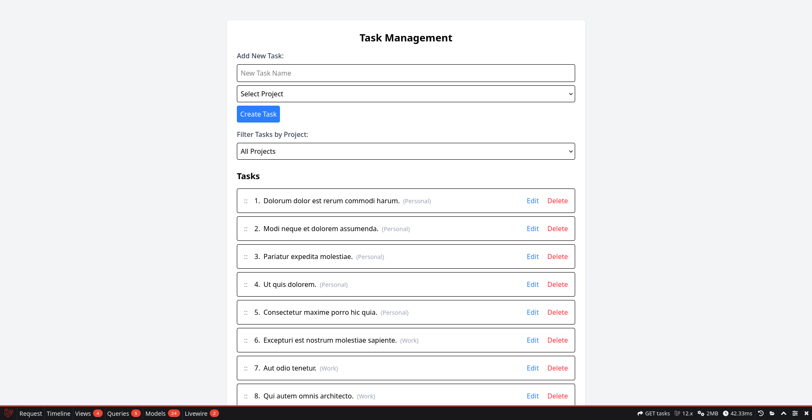

# Coalition Technologies Technical Assessment

## Created by [Mark Arneman](https://arneman.me) 



* Deployed with [Laravel Sail](https://laravel.com/docs/12.x/sail)
* Frontend built using [Livewire](https://livewire.laravel.com/)
* Linted with [Laravel Pint](https://laravel.com/docs/12.x/pint)
* Database: SQLite

### Deployment
Requires [Docker](https://www.docker.com/) be installed on the system. 

Extract the .zip or `git clone` the git repository, open terminal and run:

```
sail up -d
```

### Run migrations and seed the database
The project comes with two database migrations to create the Tasks and Projects tables. You can run the migrations using:

```
sail artisan migrate
```

Once the migrations complete, you can seed the database with example database by executing

```
sail artisan db:seed
```

Visit http://localhost to view the application